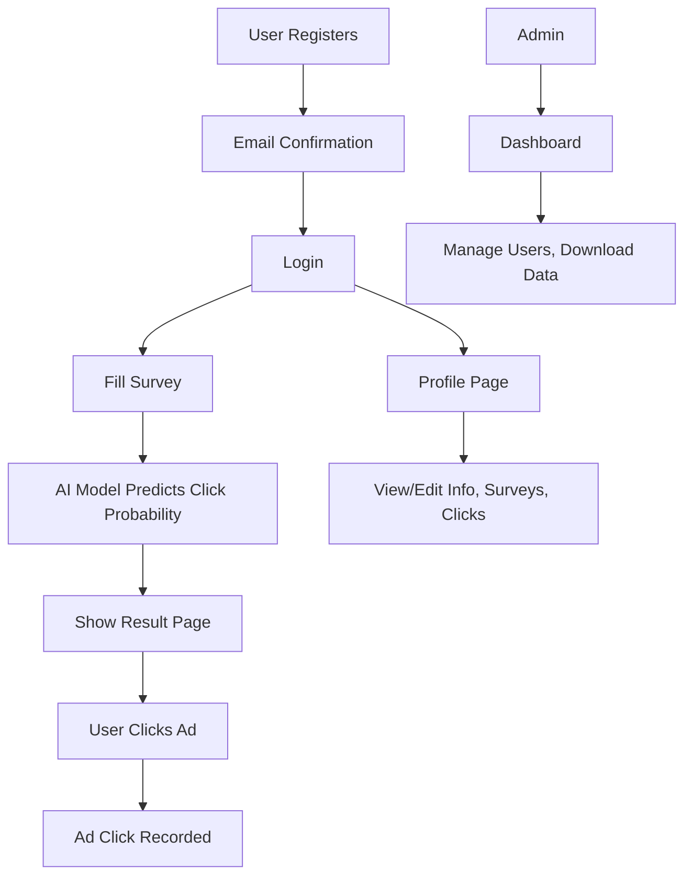

# Predicting Ad Clicks on Social Media

This project is a web application that predicts whether a user will click on an ad, based on their survey responses. It uses a custom logistic regression model and provides a full user, admin, and AI workflow.

## User Stories
- As a new user, I want to register and confirm my email so I can access the platform.
- As a user, I want to log in and fill out a survey about my online habits and ad preferences.
- As a user, I want to see a prediction of my likelihood to click on an ad, and interact with the predicted ad.
- As a user, I want to view and edit my profile, see my survey history, and track my ad clicks.
- As an admin, I want to manage users, view all survey responses, and download user data.
- As an admin, I want to ensure only confirmed users can access the platform.

## Data Flow Diagram

## How to Run the Web App
1. Clone or download the repository.
2. Install dependencies: `pip install -r requirements.txt`
3. Set up the database: `flask db upgrade`
4. (Optional) Train the AI model on collected survey data:
   - Run: `python -m app.utils.train_model`
5. Start the app: `flask run` or `python run.py`
6. Open your browser at [http://localhost:5000](http://localhost:5000)

## How to Run Tests
- Run all tests: `python -m unittest discover tests`

## Used Technologies
- Python, Flask, Flask-Login, Flask-Mail, Flask-Migrate, Flask-Bootstrap
- SQLite (default), SQLAlchemy ORM
- Custom AI model (logistic regression, NumPy)
- Bootstrap 5, HTML/CSS, JavaScript

## Features
- ✅ User registration, login, and email confirmation
- ✅ Survey and AI-powered ad click prediction
- ✅ Ad click tracking and user profile
- ✅ Admin dashboard and user management
- ✅ Custom error pages
- ✅ Unit and feature tests

## See our documents here
 [Documentation](./Documents/Documentation.docx)  
 [Presentation](./Documents/Presentation.pptx)  

---
<h1 align="center" ><a href="https://github.com/codingburgas/2425-11-b-pp-student-practices-system-for-ai-experiments-ATSivkov21">Enjoy the web page.</a></h1>