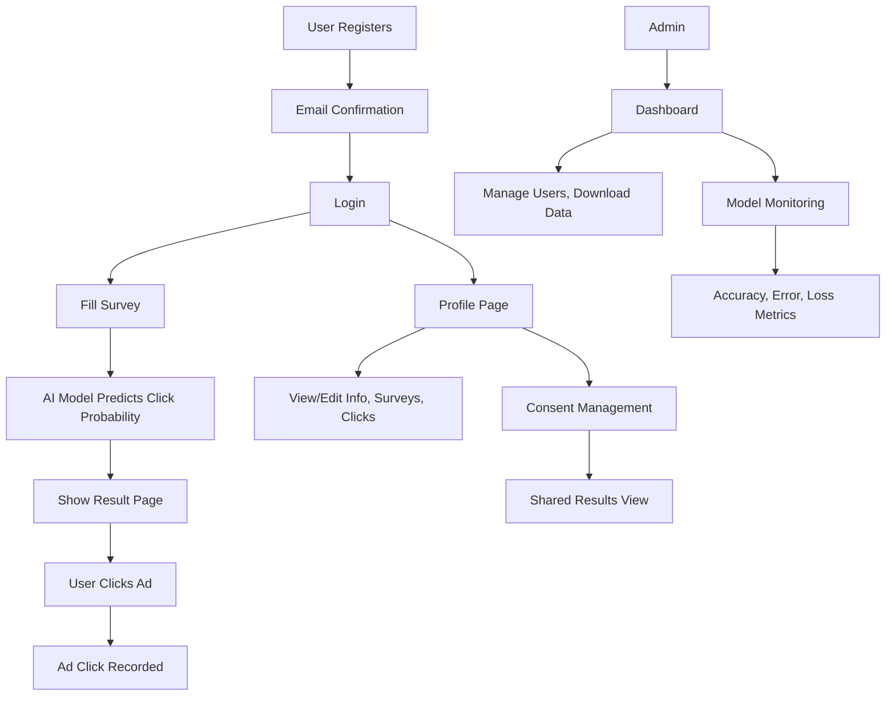

# Predicting Ad Clicks on Social Media

This project is a web application that predicts whether a user will click on an ad, based on their survey responses. It uses a custom logistic regression model and provides a full user, admin, and AI workflow with comprehensive model monitoring and user consent management.

## User Stories
- As a new user, I want to register and confirm my email so I can access the platform.
- As a user, I want to log in and fill out a survey about my online habits and ad preferences.
- As a user, I want to see a prediction of my likelihood to click on an ad, and interact with the predicted ad.
- As a user, I want to view and edit my profile, see my survey history, and track my ad clicks.
- As a user, I want to choose whether to share my results with other users and view shared results with consent.
- As an admin, I want to manage users, view all survey responses, and download user data.
- As an admin, I want to monitor the AI model's performance with accuracy, error, and loss metrics.
- As an admin, I want to ensure only confirmed users can access the platform.

## Data Flow Diagram

## How to Run the Web App
1. Clone or download the repository.
2. Install dependencies: `pip install -r requirements.txt`
3. Set up the database: `flask db upgrade`
4. (Optional) Configure email settings (see EMAIL_SETUP.md for details)
5. (Optional) Train the AI model on collected survey data:
   - Run: `python -m app.utils.train_model`
6. Start the app: `flask run` or `python run.py`
7. Open your browser at [http://localhost:5000](http://localhost:5000)

## How to Run Tests
- Run all tests: `python -m unittest discover tests`

## Used Technologies
- Python, Flask, Flask-Login, Flask-Mail, Flask-Migrate, Flask-Bootstrap
- SQLite (default), SQLAlchemy ORM
- Custom AI model (logistic regression, NumPy, scikit-learn)
- Bootstrap 5, HTML/CSS, JavaScript

## Features
- ✅ User registration, login, and email confirmation via Flask-Mail
- ✅ Survey and AI-powered ad click prediction
- ✅ Ad click tracking and user profile
- ✅ User consent management for sharing results
- ✅ View other users' results with consent
- ✅ Admin dashboard and user management
- ✅ AI model monitoring with accuracy, error, and loss metrics
- ✅ Custom error pages
- ✅ Unit and feature tests
- ✅ Proper error handling for non-existent emails
- ✅ Comprehensive AI module integration documentation

## AI Model Monitoring
The system includes comprehensive model monitoring capabilities:
- **Accuracy Tracking**: Real-time classification accuracy
- **Error Metrics**: Mean Squared Error and Log Loss
- **Training History**: Loss progression during training
- **Model Health**: Automated health status assessment
- **Overfitting Detection**: Training vs test accuracy comparison
- **Recommendations**: Automated suggestions for model improvement

## User Consent System
Users have full control over their data sharing:
- **Registration Consent**: Opt-in during account creation
- **Profile Management**: Modify consent preferences anytime
- **Shared Results**: View other users' results only with consent
- **Privacy Protection**: No personal data shared without permission

## Admin Features
Administrators have access to:
- **User Management**: Create, edit, and delete users
- **Data Export**: Download user profiles and survey data
- **Model Monitoring**: Real-time AI model performance dashboard
- **Ad Management**: Upload and manage advertisement images
- **System Analytics**: View survey submissions and ad clicks

## See our documents here
 [Documentation](./Documents/Documentation.docx)  
 [Presentation](./Documents/Presentation.pptx)  

---
<h1 align="center" ><a href="https://github.com/codingburgas/2425-11-b-pp-student-practices-system-for-ai-experiments-ATSivkov21">Enjoy the web page.</a></h1>

## Email Configuration
By default, email confirmation is disabled in development mode. To enable email confirmations:

1. **For Development**: Email confirmation is automatically disabled
2. **For Production**: See `EMAIL_SETUP.md` for detailed configuration instructions
3. **Gmail Setup**: Requires 2-factor authentication and App Password
4. **Alternative**: Use email service providers like SendGrid or Mailgun